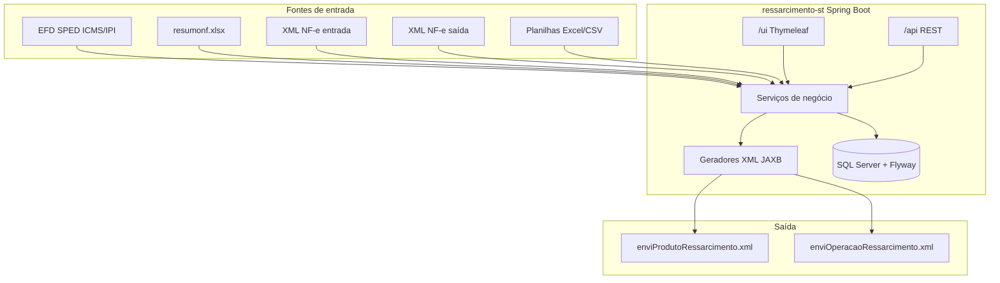
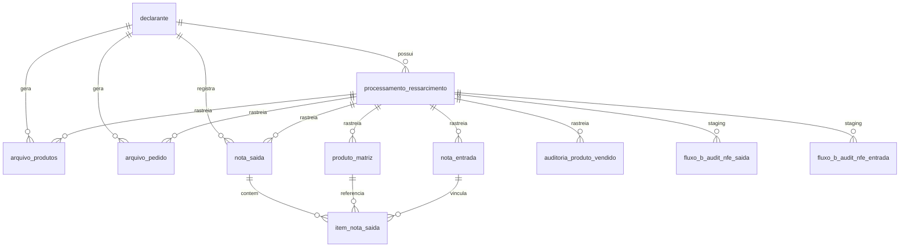
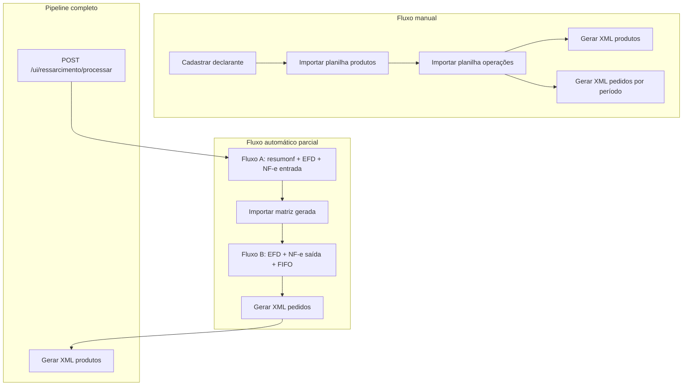
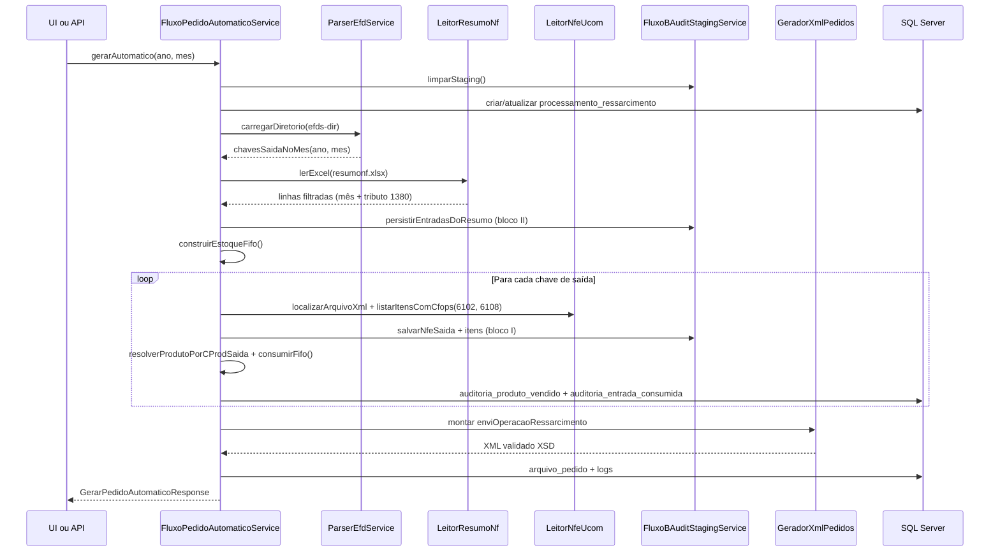
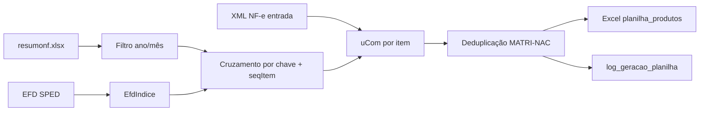

# Outline integral — Sistema de Ressarcimento ICMS-ST (SEFAZ/AM)

Documento de referência que descreve **como o projeto funciona por completo**: propósito fiscal, arquitetura, fluxos de negócio, persistência, interfaces e operações.

Complementa (sem substituir) [PLANO.md](PLANO.md), [CONFIGURACAO.md](CONFIGURACAO.md) e [docs/REQUISITO_FLUXO_B_AUDITORIA_PERSISTIDA.md](docs/REQUISITO_FLUXO_B_AUDITORIA_PERSISTIDA.md).

**Artefato Maven:** `ressarcimento-st` (`br.com.empresa:ressarcimento-st:0.0.1-SNAPSHOT`)

---

## 1. Visão geral

### 1.1 Propósito fiscal

O sistema **não** trata de reembolso genérico de despesas. Seu objetivo é apoiar o **ressarcimento de ICMS-ST** (Substituição Tributária) perante a **SEFAZ/Amazonas**, quando o contribuinte vende mercadoria sujeita a ST e precisa **vincular saídas a entradas anteriores** para comprovar o crédito fiscal.

A aplicação:

1. Cadastra o **declarante** (dados do contribuinte para o grupo `dadosDeclarante` nos XMLs).
2. Mantém a **matriz de produtos (MATRI-NAC)** — mapeamento código interno ↔ fornecedor, unidades e fator de conversão.
3. Registra **operações de saída (pedidos)** — NF-e de venda com itens elegíveis ligados às NF-e de entrada consumidas.
4. Gera os **XMLs oficiais** validados contra XSD, prontos para envio manual ou via DT-e.

### 1.2 Artefatos de saída

| Arquivo | Layout | Namespace / schema |
|---------|--------|----------------------|
| `enviProdutoRessarcimento.xml` | 1.00 | `src/main/resources/schema/produto/` |
| `enviOperacaoRessarcimento.xml` | 2.00 | `src/main/resources/schema/pedido/` |

Os XSDs oficiais estão espelhados em `pacote-trabalho/layout-schemas/`.

### 1.3 Modos de operação

| Modo | Entrada | Uso típico |
|------|---------|------------|
| **Manual** | Planilhas Excel/CSV (produtos e operações) | Importação validada linha a linha; geração de XML por período |
| **Automático** | EFD SPED + `resumonf.xlsx` + XMLs NF-e | Fluxo A (matriz) e Fluxo B (pedidos com FIFO) |
| **Pipeline completo** | Mesmas fontes do automático | Orquestra Fluxo A → importação → Fluxo B → XML produtos em uma única execução |

### 1.4 Diagrama de alto nível



---

## 2. Stack e bootstrap

### 2.1 Tecnologias

| Camada | Tecnologia |
|--------|------------|
| Linguagem | Java 17 |
| Framework | Spring Boot 3.2.5 |
| Web / API | `spring-boot-starter-web` |
| Persistência | Spring Data JPA + Hibernate |
| Banco | Microsoft SQL Server (`mssql-jdbc`) |
| Migrações | Flyway (`flyway-sqlserver`) |
| UI | Thymeleaf + Bootstrap 5 (CDN) |
| Planilhas | Apache POI 5.2.5 + leitura CSV |
| XML | Jakarta XML Bind (JAXB) |
| API docs | Springdoc OpenAPI 2.3.0 |
| Logs | Logback (+ `logstash-logback-encoder` no perfil `json-logging`) |
| Build | Maven |

### 2.2 Entry point e cadeia de inicialização

Classe principal: [`RessarcimentoApplication.java`](src/main/java/br/com/empresa/ressarcimento/RessarcimentoApplication.java)

```
1. EnvFileLoader (main)
   └─ Lê ressarcimento.env e .env na raiz; define spring.datasource.* se não houver -D na JVM

2. DotEnvEnvironmentPostProcessor
   └─ Registra variáveis RESSARCIMENTO_* no Spring Environment (prioridade alta)

3. Spring Boot
   └─ Carrega application.yml (+ perfis local, json-logging)

4. Flyway
   └─ Aplica migrações em classpath:db/migration (ddl-auto: validate)

5. Tomcat embarcado
   └─ Porta padrão 8080
```

### 2.3 Formas de execução

| Método | Comando |
|--------|---------|
| Script recomendado | `.\scripts\run-local.ps1` |
| Maven direto | `mvn spring-boot:run` |
| JAR empacotado | `mvn package` → `java -jar target/ressarcimento-st-0.0.1-SNAPSHOT.jar` |
| Banco Docker (opcional) | `docker compose up -d` + `.\scripts\sqlserver\create-database-docker.ps1` |

### 2.4 Pontos de entrada HTTP

| URL | Destino |
|-----|---------|
| `/` | Redirect → `/ui` |
| `/ui` | Interface web Thymeleaf (home) |
| `/api/*` | REST API |
| `/swagger-ui.html` | Documentação OpenAPI |
| `/v3/api-docs` | Spec OpenAPI JSON |

---

## 3. Configuração e fontes de dados externas

Detalhes completos em [CONFIGURACAO.md](CONFIGURACAO.md) e [ressarcimento.env.example](ressarcimento.env.example).

### 3.1 Banco de dados

| Variável | Descrição |
|----------|-----------|
| `RESSARCIMENTO_DB_URL` | JDBC completo (host, instância, databaseName, encrypt, etc.) |
| `RESSARCIMENTO_DB_USERNAME` | Usuário da aplicação |
| `RESSARCIMENTO_DB_PASSWORD` | Senha (não versionar) |

Configuração em [`application.yml`](src/main/resources/application.yml): JPA `ddl-auto: validate`, Flyway habilitado, database `ressarcimento`.

### 3.2 Pastas fiscais (fluxos automáticos)

Propriedades em [`RessarcimentoProperties`](src/main/java/br/com/empresa/ressarcimento/config/RessarcimentoProperties.java), com override por variável de ambiente:

| Propriedade / variável | Conteúdo | Uso |
|------------------------|----------|-----|
| `ressarcimento.resumo-notas-dir` / `RESSARCIMENTO_RESUMO_NOTAS_DIR` | `resumonf.xlsx` | Entradas elegíveis, estoque FIFO, staging |
| `ressarcimento.efds-dir` / `RESSARCIMENTO_EFDS_DIR` | Arquivos `.txt` EFD ICMS/IPI (pipe-delimited) | Chaves, itens C170, cadastro 0200 |
| `ressarcimento.nfes-dir` / `RESSARCIMENTO_NFES_DIR` | XML NF-e **entrada** | `uCom`, `dhEmi`, datas de emissão |
| `ressarcimento.nfes-saida-dir` / `RESSARCIMENTO_NFES_SAIDA_DIR` | XML NF-e **saída** | Itens CFOP 6102/6108, datas saída |

Dados operacionais de exemplo ficam em `Processamento/Entrada/`.

### 3.3 Schemas XSD

- Produtos: `src/main/resources/schema/produto/` (layout 1.00)
- Pedidos: `src/main/resources/schema/pedido/` (layout 2.00)

---

## 4. Modelo de dados

Migrações Flyway em `src/main/resources/db/migration/`. Hibernate valida o schema; alterações só via Flyway.

### 4.1 Evolução das migrações (V1–V9)

| Versão | Conteúdo |
|--------|----------|
| **V1** | Tabelas núcleo: declarante, produto_matriz, nota_saida, nota_entrada, item_nota_saida, arquivo_produtos, arquivo_pedido |
| **V2** | `log_geracao_planilha` — inconsistências do Fluxo A |
| **V3** | Auditoria Fluxo B: `execucao_fluxo_pedido`, `auditoria_produto_vendido`, `auditoria_entrada_consumida`, `log_execucao_fluxo` |
| **V4** | Staging de auditoria: `fluxo_b_audit_nfe_saida`, `fluxo_b_audit_item_nfe_saida`, `fluxo_b_audit_nfe_entrada`, `fluxo_b_audit_item_nfe_entrada` |
| **V5** | `processamento_ressarcimento` + FKs opcionais nas entidades rastreadas |
| **V6** | FK `processamento_ressarcimento_id` em produto_matriz, nota_entrada, staging e auditoria |
| **V7** | Torna `processamento_ressarcimento_id` **obrigatório**; remove registros legados sem rastreio |
| **V8** | Garante FK em `auditoria_entrada_consumida` (correção incremental) |
| **V9** | Absorve `execucao_fluxo_pedido` em `processamento_ressarcimento`; remove tabela `execucao_fluxo_pedido`; adiciona caminhos de arquivos usados no processamento |

### 4.2 Tabelas núcleo (V1)

| Tabela | Papel |
|--------|-------|
| `declarante` | Contribuinte (CNPJ raiz 8 dígitos, IE, responsável) — índice único em `cnpj_raiz` |
| `produto_matriz` | Cadastro MATRI-NAC (código interno, fornecedor, unidades, fator de conversão) |
| `nota_saida` | NF-e de saída (chave 44, período ano/mês) |
| `nota_entrada` | Chaves NF-e/CT-e/MDF-e de entrada |
| `item_nota_saida` | Itens da saída com vínculo opcional a produto_matriz e nota_entrada |
| `arquivo_produtos` | Histórico de XML de produtos (`xml_content`, status) |
| `arquivo_pedido` | Histórico de XML de pedidos por período |

Entidades JPA: pacotes `declarante.domain`, `produtos.domain`, `pedidos.domain`.

### 4.3 Rastreabilidade e auditoria

| Tabela | Papel |
|--------|-------|
| `processamento_ressarcimento` | Cabeçalho de execução orquestrada (ano/mês, status, caminhos EFD/NF-e/resumo) |
| `log_geracao_planilha` | Inconsistências na geração automática de produtos (Fluxo A) |
| `auditoria_produto_vendido` | Produto vendido × entrada consumida (Fluxo B) |
| `auditoria_entrada_consumida` | Detalhe de cada entrada consumida no FIFO |
| `log_execucao_fluxo` | Log textual por etapa do Fluxo B |
| `fluxo_b_audit_nfe_saida` / `_item_` | Staging bloco I — NF-e saída + itens CFOP elegíveis |
| `fluxo_b_audit_nfe_entrada` / `_item_` | Staging bloco II — NF-e entrada do resumonf |

Todas as entidades operacionais (exceto `declarante`) exigem `processamento_ressarcimento_id` desde V7.

### 4.4 Diagrama ER simplificado



---

## 5. Módulos e responsabilidades

### 5.1 Declarante

**Serviço:** [`DeclaranteService`](src/main/java/br/com/empresa/ressarcimento/declarante/DeclaranteService.java)

**Comportamento:**

- Um declarante ativo por instalação, identificado por `cnpj_raiz` (8 dígitos).
- POST cria ou atualiza por CNPJ raiz; GET retorna o primeiro cadastrado (404 se ausente).
- `getEntidadeOuLanca()` é chamado por todos os fluxos de produtos e pedidos — declarante é pré-requisito.

**Rotas:** `/api/declarante`, `/ui/declarante`

### 5.2 Produtos (MATRI-NAC)

**Serviço principal:** [`ProdutoService`](src/main/java/br/com/empresa/ressarcimento/produtos/ProdutoService.java)

#### Importação manual

- Upload multipart (CSV ou Excel).
- Validação Bean Validation linha a linha via `ProdutoPlanilhaDTO`.
- Se houver erro em qualquer linha: retorna `ResultadoImportacaoDTO` com erros **sem persistir**.
- Se todas válidas: apaga `log_geracao_planilha`, zera FKs em `item_nota_saida`, apaga e recria `produto_matriz` (substituição total).

#### Geração de XML produtos

- Monta `enviProdutoRessarcimento` layout 1.00 via [`GeradorXmlProdutos`](src/main/java/br/com/empresa/ressarcimento/xml/produto/GeradorXmlProdutos.java).
- Valida contra XSD antes de devolver.
- Persiste em `arquivo_produtos`; download via histórico.

#### Fluxo A — Planilha automática de produtos

**Serviço:** [`ProdutoPlanilhaAutomaticaService`](src/main/java/br/com/empresa/ressarcimento/produtos/automatizado/ProdutoPlanilhaAutomaticaService.java)

**Objetivo:** montar a MATRI-NAC cruzando três fontes:

1. `resumonf.xlsx` — linhas filtradas por ano/mês de referência.
2. EFD SPED — registros C100/C170 (nota e item), 0190/0200/0220 (cadastro e conversão).
3. XML NF-e entrada — unidade comercial (`uCom`) por chave e item.

**Passos resumidos:**

1. Valida existência das pastas configuradas.
2. Carrega índice EFD via [`ParserEfdService`](src/main/java/br/com/empresa/ressarcimento/produtos/automatizado/efd/ParserEfdService.java).
3. Lê resumo via [`LeitorResumoNf`](src/main/java/br/com/empresa/ressarcimento/produtos/automatizado/LeitorResumoNf.java).
4. Para cada linha: valida chave NF-e, busca nota/item no EFD, descrição no 0200, unidade no XML.
5. Deduplica por `(codInterno, cnpjFornecedor, codProdFornecedor)`.
6. Gera Excel + registra inconsistências em `log_geracao_planilha`.

**Endpoints:** `POST /api/produtos/gerar-planilha-automatica`, `POST /ui/produtos/gerar-planilha-automatica`, upload ZIP via `POST /api/produtos/gerar-planilha-automatica-upload`.

### 5.3 Pedidos / operações

**Serviço principal:** [`PedidoService`](src/main/java/br/com/empresa/ressarcimento/pedidos/PedidoService.java)

#### Importação manual

- Lê planilha de operações (`OperacaoPlanilhaDTO`).
- Todas as linhas devem ter o **mesmo ano e mês** de referência.
- Agrupa por chave NF-e saída; cria/atualiza `NotaSaida`, `NotaEntrada`, `ItemNotaSaida`.
- Associa `ProdutoMatriz` quando código interno existe (pode ficar null).

#### Geração manual de XML pedidos

- Query obrigatória `ano` + `mes`.
- Gera `enviOperacaoRessarcimento` layout 2.00; persiste em `arquivo_pedido`.

#### Fluxo B — Geração automática de pedidos

**Serviço:** [`FluxoPedidoAutomaticoService`](src/main/java/br/com/empresa/ressarcimento/pedidos/fluxo/FluxoPedidoAutomaticoService.java)

**Objetivo:** gerar `enviOperacaoRessarcimento` sem planilha manual de operações, cruzando saídas com entradas via **FIFO**.

**Regras de negócio críticas:**

| Regra | Valor / comportamento |
|-------|----------------------|
| CFOPs elegíveis (saída) | **6102** e **6108** |
| Filtro resumo (entrada) | `dataApresentacao` no mês; tributo **1380** (ou vazio) |
| Mapeamento produto | `cProd` XML saída = `cod_interno_produto` na matriz — **sem** fallback por `cod_prod_fornecedor` |
| Ordem FIFO | Por `cod_interno_produto`: data apresentação → chave → sequência |
| Conversão de quantidade | Via `fator_conversao` da matriz (`converterQuantidadeVenda` / `converterQuantidadeEntradaC170`) |

**Staging de auditoria:** [`FluxoBAuditStagingService`](src/main/java/br/com/empresa/ressarcimento/pedidos/fluxo/audit/FluxoBAuditStagingService.java)

- **Bloco I:** NF-e saída (chaves EFD + XML + itens CFOP) com status (XML encontrado, sem itens, erro leitura, etc.).
- **Bloco II:** NF-e entrada do resumonf (cabeçalho por chave + itens por linha).
- Limpeza total do staging **antes** de cada execução.

Especificação detalhada: [docs/REQUISITO_FLUXO_B_AUDITORIA_PERSISTIDA.md](docs/REQUISITO_FLUXO_B_AUDITORIA_PERSISTIDA.md).

**Endpoints:** `POST /api/pedidos/gerar-automatico`, `POST /ui/pedidos/gerar-automatico`, rastreabilidade via `GET /api/pedidos/rastreabilidade/{idProcessamento}`.

### 5.4 Pipeline completo — Processar Ressarcimento

**Serviço:** [`ProcessamentoRessarcimentoService`](src/main/java/br/com/empresa/ressarcimento/processamento/ProcessamentoRessarcimentoService.java)

**Método:** `executarPipelineCompleto(ano, mes, planilhaReq)`

Ordem de execução (transacional, rollback em erro):

```
1. iniciar(ano, mes) → processamento_ressarcimento (status EM_ANDAMENTO)
2. Fluxo A: produtoPlanilhaAutomaticaService.gerarPlanilhaAutomatica(...)
3. Importação da matriz: produtoService.importar(xlsx, ..., processamentoId)
4. Fluxo B: fluxoPedidoAutomaticoService.gerarAutomatico(ano, mes, processamentoId)
5. Geração XML produtos: produtoService.gerarXmlRetornandoIdArquivo(processamentoId)
6. marcarConcluido(processamentoId) ou marcarErro(...) em falha
```

Nos passos 2 e 3, o XLSX gerado (`planilha_produtos.xlsx`) é retornado no resultado do pipeline e disponibilizado para **download automático** na UI após sucesso: os bytes ficam temporariamente na sessão HTTP via [`PlanilhaPipelineDownloadStore`](src/main/java/br/com/empresa/ressarcimento/processamento/PlanilhaPipelineDownloadStore.java) e são entregues por `GET /ui/ressarcimento/processar/{processamentoId}/planilha-produtos` (consumo one-shot). A página de sucesso dispara o download via iframe oculto; um botão manual permite tentar novamente antes do consumo.

**UI:** `GET/POST /ui/ressarcimento/processar` — [`UiProcessarRessarcimentoController`](src/main/java/br/com/empresa/ressarcimento/ui/UiProcessarRessarcimentoController.java)

### 5.5 Manutenção

**Serviço:** [`ManutencaoDadosService`](src/main/java/br/com/empresa/ressarcimento/manutencao/ManutencaoDadosService.java)

`limparTudoExcetoDeclarante()` remove, em ordem respeitando FKs:

- Staging Fluxo B (itens e cabeçalhos)
- Itens e notas (saída/entrada)
- Arquivos XML, logs, auditoria, matriz de produtos
- Todos os `processamento_ressarcimento`

**Preserva:** apenas `declarante`.

**UI:** `GET/POST /ui/manutencao/limpar-dados`

---

## 6. Fluxos detalhados

### 6.1 Comparativo manual × automático × pipeline



### 6.2 Fluxo B — sequência passo a passo



**Passos em código (`gerarAutomatico`):**

1. Valida pastas EFD, NF-e saída, NF-e entrada, resumo-notas.
2. Limpa staging de auditoria.
3. Cria ou reutiliza `ProcessamentoRessarcimento`; registra caminhos utilizados.
4. Carrega EFD → lista chaves de saída no período (modelo 55), ordenadas por data documento.
5. Lê `resumonf.xlsx` → filtra por `dataApresentacao` no mês e tributo 1380.
6. Persiste staging bloco II (entradas do resumo).
7. Monta filas FIFO por `cod_interno_produto`.
8. Para cada NF-e de saída: localiza XML, filtra itens CFOP 6102/6108, mapeia produto, consome FIFO, grava staging bloco I e auditoria.
9. Gera XML via `GeradorXmlPedidos`, valida XSD, persiste `arquivo_pedido`.
10. Opcionalmente persiste `nota_saida` / `nota_entrada` quando há rastreio (`persistirNotasSeRastreio`).

### 6.3 Fluxo A — sequência resumida



---

## 7. Interface web e API REST

### 7.1 Rotas UI (`/ui/*`)

| Rota | Método | Controller | Descrição |
|------|--------|------------|-----------|
| `/ui` | GET | `HomeUiController` | Página inicial |
| `/ui/declarante` | GET, POST | `UiDeclaranteController` | Formulário declarante |
| `/ui/produtos` | GET | `UiProdutoController` | Hub produtos |
| `/ui/produtos/importar` | POST | `UiProdutoController` | Upload planilha produtos |
| `/ui/produtos/lista` | GET | `UiProdutoController` | Listagem matriz |
| `/ui/produtos/gerar-xml` | GET, POST | `UiProdutoController` | Geração XML produtos |
| `/ui/produtos/historico` | GET | `UiProdutoController` | Histórico XML produtos |
| `/ui/produtos/historico/{id}/download` | GET | `UiProdutoController` | Download XML |
| `/ui/produtos/planilha-automatica` | GET | `UiProdutoController` | Form Fluxo A |
| `/ui/produtos/gerar-planilha-automatica` | POST | `UiProdutoController` | Executa Fluxo A |
| `/ui/produtos/logs-geracao` | GET | `UiProdutoController` | Logs inconsistências |
| `/ui/pedidos` | GET | `UiPedidoController` | Hub pedidos |
| `/ui/pedidos/importar` | POST | `UiPedidoController` | Upload planilha operações |
| `/ui/pedidos/lista` | GET | `UiPedidoController` | Listagem notas saída |
| `/ui/pedidos/gerar-xml` | GET, POST | `UiPedidoController` | Geração XML pedidos |
| `/ui/pedidos/gerar-automatico` | GET, POST | `UiPedidoController` | Executa Fluxo B |
| `/ui/pedidos/historico` | GET | `UiPedidoController` | Histórico XML pedidos |
| `/ui/pedidos/historico/{id}/download` | GET | `UiPedidoController` | Download XML |
| `/ui/ressarcimento/processar` | GET, POST | `UiProcessarRessarcimentoController` | Pipeline completo |
| `/ui/ressarcimento/processar/{id}/planilha-produtos` | GET | `UiProcessarRessarcimentoController` | Download one-shot da planilha gerada no Fluxo A (pipeline) |
| `/ui/manutencao/limpar-dados` | GET, POST | `UiManutencaoController` | Reset operacional |

Templates Thymeleaf em `src/main/resources/templates/ui/`.

### 7.2 Rotas API (`/api/*`)

| Rota | Método | Controller | Descrição |
|------|--------|------------|-----------|
| `/api/declarante` | POST, GET | `DeclaranteController` | CRUD declarante |
| `/api/produtos/importar` | POST | `ProdutoController` | Upload planilha produtos |
| `/api/produtos` | GET | `ProdutoController` | Listagem paginada (filtros codigo, descricao) |
| `/api/produtos/gerar-xml` | POST | `ProdutoController` | Gera XML produtos |
| `/api/produtos/historico` | GET | `ProdutoController` | Histórico paginado |
| `/api/produtos/historico/{id}/download` | GET | `ProdutoController` | Download XML |
| `/api/produtos/gerar-planilha-automatica` | POST | `ProdutoController` | Fluxo A (JSON body opcional) |
| `/api/produtos/gerar-planilha-automatica-upload` | POST | `ProdutoController` | Fluxo A via upload ZIP |
| `/api/produtos/logs-geracao-planilha` | GET | `ProdutoController` | Logs inconsistências |
| `/api/pedidos/importar` | POST | `PedidoController` | Upload planilha operações |
| `/api/pedidos` | GET | `PedidoController` | Listagem notas (filtros ano, mes) |
| `/api/pedidos/gerar-xml` | POST | `PedidoController` | Gera XML pedidos (query ano, mes) |
| `/api/pedidos/historico` | GET | `PedidoController` | Histórico paginado |
| `/api/pedidos/historico/{id}/download` | GET | `PedidoController` | Download XML |
| `/api/pedidos/gerar-automatico` | POST | `PedidoController` | Fluxo B |
| `/api/pedidos/execucoes` | GET | `PedidoController` | Listagem execuções Fluxo B |
| `/api/pedidos/rastreabilidade/{idProcessamento}` | GET | `PedidoController` | Detalhe auditoria por processamento |

Documentação interativa: `/swagger-ui.html`

### 7.3 Tratamento de erros

| Handler | Escopo | Comportamento |
|---------|--------|---------------|
| `GlobalExceptionHandler` | `@RestController` | JSON `ErrorResponse`: validação, declarante não encontrado, erros de importação |
| `UiExceptionHandler` | Controllers Thymeleaf | View `ui/error` para exceções de negócio e I/O |

---

## 8. Geração e validação de XML

### 8.1 XML de produtos

**Classe:** [`GeradorXmlProdutos`](src/main/java/br/com/empresa/ressarcimento/xml/produto/GeradorXmlProdutos.java)

- Layout **1.00**, namespace `http://www.sefaz.am.gov.br/ressarcimento`
- Monta JAXB `EnviProdutoRessarcimento` a partir de `produto_matriz` + dados do declarante
- Valida via [`ValidadorXmlProdutoRessarcimento`](src/main/java/br/com/empresa/ressarcimento/xml/produto/ValidadorXmlProdutoRessarcimento.java) contra XSD
- Exige ao menos um produto na matriz

### 8.2 XML de pedidos

**Classe:** [`GeradorXmlPedidos`](src/main/java/br/com/empresa/ressarcimento/xml/pedido/GeradorXmlPedidos.java)

- Layout **2.00**
- Monta JAXB `EnviOperacaoRessarcimento` a partir de notas de saída/itens do período
- Usado tanto na importação manual quanto no Fluxo B automático

### 8.3 Validação

Ambos os geradores validam o XML gerado contra os XSDs em `src/main/resources/schema/` **antes** de persistir ou devolver ao cliente. Falha de validação impede gravação em `arquivo_produtos` / `arquivo_pedido`.

---

## 9. Componentes de leitura de arquivos

| Componente | Pacote / arquivo | Responsabilidade |
|------------|------------------|------------------|
| `ParserEfdService` | `produtos.automatizado.efd` | Parse SPED EFD ICMS/IPI; índice `EfdIndice` com C100, C170, 0190, 0200, 0220 |
| `LeitorResumoNf` | `produtos.automatizado` | Leitura `resumonf.xlsx` → `ResumoNfLinhaDTO` (CHAVE, NR. NOTA, DATA APRES., CODG. ITEM, tributo, etc.) |
| `LeitorNfeUcom` | `produtos.automatizado` | Localiza XML por chave 44; extrai itens por CFOP; campos `ide` (`dhEmi`, `dhSaiEnt`, `dEmi`) |
| `LeitorPlanilhaProdutos` | `planilhas` | Excel/CSV manual de produtos |
| `LeitorPlanilhaOperacoes` | `planilhas` | Excel/CSV manual de operações |
| `EscritorPlanilhaProdutosExcel` | `produtos.automatizado` | Gera Excel da matriz no Fluxo A |
| `ValidacaoPlanilhaUtil` | `planilhas` | Utilitários de validação compartilhados |

---

## 10. Estrutura de diretórios do repositório

```
Ressarcimento/
├── OUTLINE.md              ← este documento
├── PLANO.md                ← plano de implementação e estado
├── CONFIGURACAO.md         ← variáveis de ambiente
├── pom.xml                 ← build Maven
├── docker-compose.yml      ← SQL Server 2022 opcional
├── ressarcimento.env.example
│
├── src/
│   ├── main/java/br/com/empresa/ressarcimento/
│   │   ├── RessarcimentoApplication.java
│   │   ├── config/         ← propriedades, WebMvc, .env
│   │   ├── declarante/     ← cadastro contribuinte
│   │   ├── produtos/       ← matriz, importação, XML produtos
│   │   │   └── automatizado/  ← Fluxo A (EFD, resumo, NF-e)
│   │   ├── pedidos/        ← operações, importação, XML pedidos
│   │   │   └── fluxo/      ← Fluxo B (FIFO, auditoria, staging)
│   │   ├── processamento/  ← pipeline orquestrado
│   │   ├── planilhas/      ← leitores Excel/CSV
│   │   ├── xml/            ← geradores JAXB + validação XSD
│   │   ├── ui/             ← controllers Thymeleaf
│   │   ├── manutencao/     ← limpeza de dados
│   │   └── shared/         ← exceções, DTOs, OpenAPI
│   ├── main/resources/
│   │   ├── application.yml
│   │   ├── db/migration/   ← Flyway V1–V9
│   │   ├── schema/         ← XSDs produto e pedido
│   │   ├── templates/ui/   ← páginas Thymeleaf
│   │   └── static/         ← index.html (redirect /ui)
│   └── test/               ← testes unitários e integração
│
├── Processamento/          ← dados operacionais (EFD, NF-e, resumo)
│   └── Entrada/
│       ├── efds/
│       ├── nfes-entrada/
│       ├── nfes-saida/
│       └── resumo-notas/
│
├── pacote-trabalho/        ← materiais de referência
│   ├── layout-schemas/     ← XSDs originais SEFAZ/AM
│   ├── comparar-efds/      ← EFDs corrigidos e diffs
│   └── arquivos originais/ ← XMLs históricos
│
├── scripts/
│   ├── run-local.ps1
│   └── sqlserver/          ← criação DB, diagnóstico, login
│
└── docs/
    └── REQUISITO_FLUXO_B_AUDITORIA_PERSISTIDA.md
```

---

## 11. Testes

### 11.1 Infraestrutura

| Ambiente | Uso |
|----------|-----|
| **H2** (escopo test) | Testes unitários e integração padrão (`application-test.yml`) |
| **SQL Server real** | `RessarcimentoSqlServerIntegrationTest` — ativado com `RESSARCIMENTO_SQLSERVER_INTEGRATION=true` |

### 11.2 Principais classes de teste

| Teste | Escopo |
|-------|--------|
| `DeclaranteServiceTest` | Serviço declarante |
| `DeclaranteApiIntegrationTest` | API REST declarante |
| `ProdutoServiceTest` | Importação e listagem produtos |
| `PedidoServiceTest` | Importação pedidos |
| `ProdutoPlanilhaAutomaticaApiTest` | Fluxo A via API |
| `ProdutoPlanilhaAutomaticaSemXmlApiTest` | Fluxo A sem XML disponível |
| `ParserEfdServiceTest` | Parse EFD |
| `LeitorResumoNfTest` | Leitura resumonf |
| `LeitorNfeUcomTest` / `LeitorNfeUcomIdeTest` | Leitura XML NF-e |
| `FluxoBAuditStagingServiceTest` | Staging auditoria Fluxo B |
| `ProcessamentoRessarcimentoServiceTest` | Pipeline completo |
| `GeradorXmlProdutosXsdTest` / `GeradorXmlPedidosXsdTest` | Validação XSD |
| `ManutencaoDadosServiceIntegrationTest` | Limpeza operacional |
| `UiMvcTest` | MockMvc: home, declarante, import produtos |
| `UiProcessarRessarcimentoControllerTest` | Tela pipeline |
| `UiManutencaoControllerTest` | Tela manutenção |
| `RessarcimentoApplicationIntegrationTest` | Contexto Spring (H2) |
| `RessarcimentoSqlServerIntegrationTest` | Integração SQL Server |

---

## 12. Limitações e evoluções previstas

### 12.1 Limitações atuais

- **Sem autenticação** — aplicação exposta sem Spring Security; uso previsto em rede interna.
- **Single-declarante** — várias operações assumem o primeiro (ou único) declarante cadastrado.
- **Sem envio DT-e** — gera XML para download; transmissão à SEFAZ é manual/externa.
- **Substituição total da matriz** — reimportação de produtos apaga matriz anterior (com desvinculação de FKs).
- **Sem integração fiscal externa** — não consulta SEFAZ nem valida chaves online.

### 12.2 Roadmap sugerido

Ver seção 7 de [PLANO.md](PLANO.md):

- Autenticação (OAuth2/JWT ou Basic), HTTPS
- Multi-declarante / tenancy
- Política de reimportação (upsert, conflitos de chave)
- Validação fiscal adicional por versão de layout
- Assinatura e envio DT-e
- Observabilidade (métricas, correlation id)

---

## 13. Referências cruzadas

| Documento | Conteúdo |
|-----------|----------|
| [PLANO.md](PLANO.md) | Objetivo, módulos REST, estado de implementação, roadmap |
| [CONFIGURACAO.md](CONFIGURACAO.md) | Variáveis JDBC, pastas fiscais, perfil json-logging |
| [ressarcimento.env.example](ressarcimento.env.example) | Template de configuração local (SQL Server, pastas) |
| [docs/REQUISITO_FLUXO_B_AUDITORIA_PERSISTIDA.md](docs/REQUISITO_FLUXO_B_AUDITORIA_PERSISTIDA.md) | Spec staging blocos I e II do Fluxo B |
| [scripts/run-local.ps1](scripts/run-local.ps1) | Execução local com `.env` |
| [scripts/sqlserver/](scripts/sqlserver/) | Criação e diagnóstico do banco SQL Server |
| [application.yml](src/main/resources/application.yml) | Configuração Spring Boot padrão |
| [pacote-trabalho/layout-schemas/](pacote-trabalho/layout-schemas/) | XSDs oficiais SEFAZ/AM (fonte dos schemas em runtime) |

---

## Mapa de serviços-chave

| Serviço | Arquivo | Função central |
|---------|---------|----------------|
| `DeclaranteService` | `declarante/DeclaranteService.java` | CRUD declarante; `getEntidadeOuLanca()` |
| `ProdutoService` | `produtos/ProdutoService.java` | Importação matriz, geração XML produtos |
| `PedidoService` | `pedidos/PedidoService.java` | Importação operações, geração XML pedidos manual |
| `ProdutoPlanilhaAutomaticaService` | `produtos/automatizado/ProdutoPlanilhaAutomaticaService.java` | Fluxo A |
| `FluxoPedidoAutomaticoService` | `pedidos/fluxo/FluxoPedidoAutomaticoService.java` | Fluxo B (FIFO, auditoria, XML) |
| `ProcessamentoRessarcimentoService` | `processamento/ProcessamentoRessarcimentoService.java` | Pipeline end-to-end |
| `PlanilhaPipelineDownloadStore` | `processamento/PlanilhaPipelineDownloadStore.java` | Sessão HTTP para download one-shot da planilha do pipeline |
| `FluxoBAuditStagingService` | `pedidos/fluxo/audit/FluxoBAuditStagingService.java` | Staging blocos I e II |
| `ParserEfdService` | `produtos/automatizado/efd/ParserEfdService.java` | Índice EFD SPED |
| `GeradorXmlProdutos` | `xml/produto/GeradorXmlProdutos.java` | JAXB produtos v1.00 |
| `GeradorXmlPedidos` | `xml/pedido/GeradorXmlPedidos.java` | JAXB pedidos v2.00 |
| `ManutencaoDadosService` | `manutencao/ManutencaoDadosService.java` | Reset operacional |

---

*Documento gerado com base na análise do repositório. Atualize este outline quando houver mudanças significativas de arquitetura ou fluxo de negócio.*
