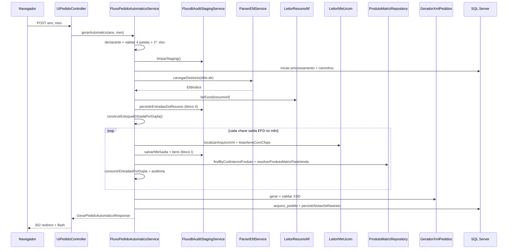

# Outline integral — `/ui/pedidos/gerar-automatico` (Fluxo B)

Documento de referência que descreve **todo o funcionamento** do endpoint de interface web que gera automaticamente o XML de operações de ressarcimento (`enviOperacaoRessarcimento.xml`, layout 2.00), incluindo camada UI, orquestração de negócio, regras fiscais, persistência e comportamentos particulares.

Complementa [OUTLINE.md](OUTLINE.md) (visão do sistema), [CONFIGURACAO.md](CONFIGURACAO.md) e [docs/REQUISITO_FLUXO_B_AUDITORIA_PERSISTIDA.md](docs/REQUISITO_FLUXO_B_AUDITORIA_PERSISTIDA.md).

---

## 1. Papel no sistema

| Aspecto | Descrição |
|---------|-----------|
| **Nome de negócio** | Fluxo B — geração automática de XML de **pedidos/operações** |
| **Rota UI** | `GET` e `POST` `/ui/pedidos/gerar-automatico` |
| **Equivalente API** | `POST /api/pedidos/gerar-automatico` (JSON, sem redirect) |
| **Serviço central** | `FluxoPedidoAutomaticoService.gerarAutomatico(ano, mes)` |
| **Saída principal** | XML validado contra XSD + registro em `arquivo_pedido` |
| **Pré-requisito operacional** | Declarante cadastrado + **matriz de produtos** (`produto_matriz`) no banco, normalmente após Fluxo A e importação |

O Fluxo B **não** gera a planilha de produtos nem importa a matriz; apenas consome a matriz existente e cruza EFD, `resumonf.xlsx` e pastas de XML de NF-e.

---

## 2. Contrato HTTP (camada UI)

### 2.1 Controller

**Classe:** `br.com.empresa.ressarcimento.ui.UiPedidoController`  
**Prefixo:** `@RequestMapping("/ui/pedidos")`

### 2.2 `GET /ui/pedidos/gerar-automatico`

| Parâmetro query | Obrigatório | Uso |
|-----------------|-------------|-----|
| `ano` | Não | Pré-preenche o campo ano no formulário (`anoPrefill`) |
| `mes` | Não | Pré-preenche o campo mês (`mesPrefill`) |

**Comportamento:**

- Define `pageTitle`: *Pedidos — gerar XML automático (Fluxo B)*.
- Renderiza o template Thymeleaf `ui/pedidos/gerar-automatico.html`.
- Link típico a partir do pipeline: `/ui/pedidos/gerar-automatico?ano=2024&mes=7` (ver `processar.html`).

**Não executa** processamento; apenas exibe o formulário e mensagens flash de uma execução anterior (POST + redirect).

### 2.3 `POST /ui/pedidos/gerar-automatico`

| Parâmetro form | Obrigatório | Tipo | Validação HTML |
|----------------|-------------|------|----------------|
| `ano` | Sim | `int` | `min=2000`, `max=2100` |
| `mes` | Sim | `int` | `min=1`, `max=12` |

**Comportamento:**

1. Chama `fluxoPedidoAutomaticoService.gerarAutomatico(ano, mes)` — **sem** `processamentoRessarcimentoId` (cria novo processamento).
2. Em **sucesso**, grava atributos flash e redireciona para `GET` (padrão PRG):
   - `fluxoBSuccess` = `true`
   - `fluxoBIdProcessamento` ← `resp.processamentoRessarcimentoId`
   - `fluxoBArquivoPedidoId` ← `resp.arquivoPedidoId`
   - `fluxoBStatus` ← `resp.status`
   - `fluxoBAvisos` ← `resp.avisos` (lista, pode ser vazia)
3. Em **qualquer exceção**, grava `fluxoBError` com `ex.getMessage()` ou nome da classe.
4. **Sempre** retorna `redirect:/ui/pedidos/gerar-automatico` (não devolve XML inline na resposta POST).

**Particularidade:** erros de negócio (`IllegalArgumentException`, diretórios ausentes, falha de staging) e erros técnicos (`IOException`, `JAXBException`) são tratados da mesma forma na UI — mensagem única em `fluxoBError`.

### 2.4 Diferença em relação à API REST

| Item | UI (`UiPedidoController`) | API (`PedidoController`) |
|------|---------------------------|---------------------------|
| Método | GET (form) + POST (form) | POST apenas |
| Corpo | `application/x-www-form-urlencoded` | JSON `GerarPedidoAutomaticoRequest` |
| Resposta sucesso | Redirect + flash | `200` + `GerarPedidoAutomaticoResponse` |
| Resposta erro | Flash + redirect | Exceção → handler HTTP (4xx/5xx) |
| Download XML | Link para `/ui/pedidos/historico/{id}/download` | `GET /api/pedidos/historico/{id}/download` |

Ambos invocam o **mesmo** método de serviço com dois argumentos (`ano`, `mes`).

### 2.5 Invocação indireta (pipeline completo)

`ProcessamentoRessarcimentoService.executarPipelineCompleto` chama:

```text
fluxoPedidoAutomaticoService.gerarAutomatico(ano, mes, processamentoId)
```

Nessa variante, **não** cria novo `processamento_ressarcimento`; reutiliza o id do pipeline e compartilha o mesmo registro com Fluxo A, importação de matriz e XML de produtos.

A página `/ui/pedidos/gerar-automatico` **nunca** usa a sobrecarga com três parâmetros.

---

## 3. Interface Thymeleaf

**Arquivo:** `src/main/resources/templates/ui/pedidos/gerar-automatico.html`

### 3.1 Conteúdo informativo

- Lista variáveis de ambiente / `application.yml`: `RESSARCIMENTO_EFDS_DIR`, `RESSARCIMENTO_NFES_SAIDA_DIR`, `RESSARCIMENTO_NFES_DIR`, `RESSARCIMENTO_RESUMO_NOTAS_DIR`.
- Informa CFOPs elegíveis na saída: **6102** e **6108**.
- Link para `/ui/ressarcimento/processar` (pipeline A+B+XML produtos num passo).

### 3.2 Feedback pós-execução

| Flash attribute | UI |
|-----------------|-----|
| `fluxoBError` | Alerta vermelho com texto do erro |
| `fluxoBSuccess` | Alerta verde: status, `idProcessamento`, botões |
| `fluxoBArquivoPedidoId` | Botão *Baixar XML gerado* → `GET /ui/pedidos/historico/{id}/download` |
| `fluxoBIdProcessamento` | Link *Rastreabilidade (JSON)* → `GET /api/pedidos/rastreabilidade/{id}` (nova aba) |
| `fluxoBAvisos` | Lista `<ul>` de strings (execução concluída com ressalvas) |

### 3.3 UX no submit

Script inline no submit do formulário `#formFluxoB`:

- Desabilita o botão `#btnFluxoB`.
- Exibe *A executar Fluxo B…* (`#fluxoProcessando`).

A operação pode ser **longa** (leitura de EFD, centenas de XMLs, transação JPA única); não há barra de progresso server-side.

### 3.4 Navegação

Entradas no menu (`fragments/nav.html`) e home (`ui/home.html`): *Gerar XML automático (Fluxo B)*.

---

## 4. Orquestração — `FluxoPedidoAutomaticoService.gerarAutomatico`

**Classe:** `br.com.empresa.ressarcimento.pedidos.fluxo.FluxoPedidoAutomaticoService`  
**Transação:** `@Transactional` em todo o método (limpeza staging + processamento + persistência).

### 4.1 Assinaturas

```java
GerarPedidoAutomaticoResponse gerarAutomatico(int ano, int mes)
GerarPedidoAutomaticoResponse gerarAutomatico(int ano, int mes, Long processamentoRessarcimentoId)
```

A UI usa apenas a primeira (delega para a segunda com `processamentoRessarcimentoId = null`).

### 4.2 Resposta (`GerarPedidoAutomaticoResponse`)

| Campo | Significado |
|-------|-------------|
| `processamentoRessarcimentoId` | Id do rastreio da execução |
| `arquivoPedidoId` | Id em `arquivo_pedido` para download do XML |
| `status` | Status final em `processamento_ressarcimento.status_execucao` |
| `avisos` | Lista acumulada de mensagens não fatais (WARNs operacionais) |

### 4.3 Status de execução

Constantes em `FluxoPedidoAutomaticoService` (espelhadas em `ProcessamentoRessarcimento`):

| Status | Quando |
|--------|--------|
| `EM_ANDAMENTO` | Início, após validar diretórios e criar/atualizar processamento |
| `CONCLUIDO` | XML gerado e salvo; **sem** avisos |
| `CONCLUIDO_COM_AVISOS` | XML gerado; lista `avisos` não vazia |
| `ERRO` | Exceção no `catch` ou falha antes de gerar XML (ex.: nenhuma nota elegível) |

Em erro, `data_hora_fim` é preenchida, log `GERAL` é gravado e a exceção é **relançada** (UI captura no controller).

### 4.4 Diagrama de sequência (visão completa)



---

## 5. Pré-requisitos e configuração

### 5.1 Declarante

`declaranteService.getEntidadeOuLanca()` — sem declarante a execução falha antes do processamento útil.

### 5.2 Matriz de produtos

Tabela `produto_matriz` populada (manual ou Fluxo A + importação).

**Regra crítica de mapeamento (saída):**

- `cProd` do XML da NF-e de saída deve ser igual a `cod_interno_produto`.
- Busca: `produtoMatrizRepository.findFirstByCodInternoProduto(cProd.trim())`.
- **Não** há fallback por `cod_prod_fornecedor`.

**Regra crítica (entrada / vínculo por dupla):**

- Resumo: chave de fila = `CNPJ FORNECEDOR` (14 dígitos) + `CODG. ITEM` (cod_prod_fornecedor).
- Matriz: `findByCnpjFornecedorAndCodProdFornecedor(cnpj, codg)`.
- EFD: validação por chave 44 + `seqItem` do resumo + **`COD_ITEM` = `cod_interno_produto`** (passo 3 / matriz da dupla).

### 5.3 Propriedades (`RessarcimentoProperties` / `application.yml`)

| Propriedade | Variável de ambiente | Conteúdo esperado |
|-------------|----------------------|-------------------|
| `ressarcimento.efds-dir` | `RESSARCIMENTO_EFDS_DIR` | Diretório com arquivos EFD SPED (`.txt`) |
| `ressarcimento.nfes-saida-dir` | `RESSARCIMENTO_NFES_SAIDA_DIR` | XML NF-e de **saída** (nome contém chave 44) |
| `ressarcimento.nfes-dir` | `RESSARCIMENTO_NFES_DIR` | XML NF-e de **entrada** |
| `ressarcimento.resumo-notas-dir` | `RESSARCIMENTO_RESUMO_NOTAS_DIR` | Pasta com pelo menos um `.xlsx` |

**Validação:** `exigirDir` — propriedade não vazia + path existe e é diretório; senão `IllegalArgumentException` ou `RecursoNaoEncontradoException`.

**Resumo NF:** `resolverPrimeiroXlsx` — primeiro arquivo `.xlsx` por ordem alfabética do nome no diretório (não há seleção por nome fixo além disso).

---

## 6. Algoritmo passo a passo

### Passo 0 — Formatação de período

- `anoStr` = `%04d`
- `mesStr` = `01`–`09` com zero à esquerda; `10`–`12` sem zero extra

### Passo 1 — Limpeza de staging global

`fluxoBAuditStagingService.limparStaging()` — ordem:

1. `fluxo_b_audit_item_nfe_saida`
2. `fluxo_b_audit_nfe_saida`
3. `fluxo_b_audit_item_nfe_entrada`
4. `fluxo_b_audit_nfe_entrada`

**Política:** staging reflete **apenas a última execução** de `gerarAutomatico` na instalação (não histórico por período).

### Passo 2 — Processamento de rastreio

| Cenário UI | Ação |
|------------|------|
| `processamentoRessarcimentoId == null` | `ProcessamentoRessarcimentoLifecycle.iniciarEmAndamento(ano, mes)` |
| Id informado (pipeline) | `findById` ou `IllegalArgumentException` |

Atualiza no registro:

- `status_execucao` = `EM_ANDAMENTO`
- `arquivo_efd_utilizado`, `pasta_nfes_saida`, `pasta_nfes_entrada`, `arquivo_resumonf` (caminhos absolutos usados)

`MDC.put("idProcessamento", ...)` para logs.

### Passo 3 — EFD: chaves de saída no período

`parserEfdService.carregarDiretorio(dirEfd)` → `EfdIndice`.

`chavesSaidaNoMes(ano, mes)`:

- Filtra `dataDocumentoSaida` (data do documento no C100 de saída, modelo 55) com ano/mês informados.
- Ordenação: data documento (nulls por último), depois chave.

Se vazio: aviso + log `LEITURA_EFD` WARN — **não aborta** imediatamente.

### Passo 4 — Resumo NF (`resumonf.xlsx`)

`leitorResumoNf.lerExcel` → filtros:

| Filtro | Regra |
|--------|-------|
| Data | `dataApresentacao` no ano/mês informados |
| Tributo | vazio **ou** `"1380"` (trim) |

### Passo 5 — Staging bloco (II) — entradas do resumo

`persistirEntradasDoResumo(linhas, dirNfeEntrada, leitorNfeUcom, procRef, indice)`:

- Agrupa por chave 44.
- Cabeçalho: chave, `nrNota`, `dataApresentacao`, emissão do XML entrada (`dhEmi` ou `dEmi`) se XML existir.
- Um item por linha da planilha; campos numéricos/CFOP enriquecidos do C170 EFD quando faltam na planilha.
- Falha aqui → `IOException` com prefixo *Falha ao gravar staging de auditoria (resumo NF entrada)*.

### Passo 6 — Estoque de entradas por dupla (em memória)

`construirEstoqueEntradaPorDupla(linhasResumo, indice, proc, avisos)`:

- Ordena linhas: `dataApresentacao` → `chave` → `seqItem`.
- Para cada linha com chave 44: localiza NF entrada no EFD (`notaEntradaPorChave`).
- Chave de fila: `CNPJ|CODG. ITEM` (`chaveDuplaResumo`).
- Resolve matriz por `findByCnpjFornecedorAndCodProdFornecedor(cnpj, codg)`.
- **Passo 6:** localiza C170 por `findItem(seqItem, cod_interno_produto)` — exige `COD_ITEM` = código interno da matriz (equivalente ao passo 3 na venda).
- Converte quantidade para unidade interna (`converterQuantidadeEntradaC170`).
- Empilha em `Map<String, ArrayDeque<EntradaDuplaSlot>>` por dupla fornecedor.

### Passo 7 — Loop NF-e de saída

Para cada `chaveSaida` em `chavesSaida`:

#### 7.1 XML ausente

- Staging saída: status `SEM_XML`
- Aviso + log `LEITURA_XML_SAIDA` WARN
- **Continua** próxima chave

#### 7.2 Leitura XML

- IDE: `dhSaiEnt`, `dhEmi`, `dEmi` (truncados 35/12 chars)
- `data_doc_efd` opcional da EFD
- Itens: `listarItensComCfops(xml, {6102, 6108})`

Erro de leitura:

- Staging: `ERRO_LEITURA_XML` (sem itens)
- Aviso + log ERROR
- **Continua**

Sem itens CFOP elegíveis:

- Staging: `SEM_ITENS_CFOP`
- **Continua** (sem montar `NotaSaida`)

Com itens:

- Staging: `OK` + CFOPs agregados (até 200 chars) + itens com `cProd`, `nItem`, `qCom`, FK `produto_matriz` se resolvido

#### 7.3 Montagem de operação e vínculo de entradas

Para cada item elegível:

1. `resolverProdutoMatrizParaVenda` — a partir de `cProd` (`findByCodInternoProduto`); se várias matrizes com o mesmo código interno, preferência pela dupla com estoque disponível; se vazio: aviso `MAPEAMENTO_PRODUTO`, **pula item**.
2. `converterQuantidadeVenda` — unidade XML = unidade interna **ou** `qCom * fator_conversao`.
3. `consumirEntradasPorDupla` — consome fila da dupla `(cnpj_fornecedor, cod_prod_fornecedor)` da matriz, **somente slots cujo C170.COD_ITEM = cod_interno do passo 3**; pode usar várias entradas; registra `AuditoriaProdutoVendido` + `AuditoriaEntradaConsumida` no processamento.
4. Monta `ItemNotaSaida` com `notaEntrada` principal (primeira entrada consumida) e `chavesNfeEntradaConsumidas` (todas as chaves consumidas).

`NotaSaida` só entra em `notasMontadas` se tiver **ao menos um item** após mapeamento.

### Passo 8 — Validação mínima de saída

Se `notasMontadas.isEmpty()`:

- Status processamento = `ERRO`
- Log `GERACAO_XML` ERROR
- `IllegalArgumentException`: *nenhuma NF-e de saída com itens elegíveis (CFOP 6102/6108) e produto mapeado*

### Passo 9 — Geração XML

`geradorXmlPedidos.gerar(decl, anoStr, mesStr, notasMontadas)`:

- Layout `enviOperacaoRessarcimento` v2.00
- Chaves de entrada apenas em `listaNFeEntrada` (regra manual SEFAZ)
- Validação XSD via `ValidadorXmlOperacaoRessarcimento`

### Passo 10 — Persistência de resultado

`ArquivoPedido`:

- `status` = `GERADO_FLUXO_B`
- `xmlContent` = XML completo
- FK `processamento_ressarcimento`

`persistirNotasSeRastreio(pid, decl, notasMontadas)`:

- Para chave de saída já existente: alinha `processamento_ressarcimento_id` se declarante coincide.
- Cria ou atualiza `nota_entrada` para chaves referenciadas (principal + consumo por dupla).
- **Particularidade:** evita saída no processamento atual com entradas presas a processamento anterior.

### Passo 11 — Finalização

- `data_hora_fim` = agora
- Status `CONCLUIDO` ou `CONCLUIDO_COM_AVISOS`
- Retorno `GerarPedidoAutomaticoResponse`

---

## 7. Regras de negócio (resumo)

| Tema | Regra |
|------|-------|
| CFOP saída (XML) | Somente **6102** e **6108** |
| Filtro resumo entrada | Mês/ano por `dataApresentacao`; tributo **1380** ou vazio |
| Ordem de consumo | Por dupla `CNPJ|cod_prod_fornecedor`: data apresentação → chave NF → seq. item |
| Mapeamento saída | `cProd` = `cod_interno_produto`; desempate por dupla com estoque |
| Mapeamento entrada | Resumo `CNPJ` + `CODG. ITEM` → matriz → EFD (chave + seq + **cod_interno**) → fila por dupla |
| Conversão quantidade | Se `uCom`/`unid` ≠ unidade interna → multiplica `fator_conversao` da matriz |
| Elegibilidade EFD saída | C100 saída (`IND_OPER=1`), modelo 55, data documento no mês |
| Estoque insuficiente | Item ainda pode ir ao XML; `suficiente=false` na auditoria + aviso implícito nos dados |

---

## 8. Consumo de entradas por dupla — `consumirEntradasPorDupla`

Entrada: quantidade vendida em unidade interna, linha da matriz (dupla fornecedor), **cod_interno da venda (passo 3)**, mapa de filas por dupla, processamento.

1. Se quantidade ≤ 0 ou fila vazia: retorna `suficiente` true apenas se need = 0; senão insuficiente sem entradas.
2. Enquanto `need > 0` e fila não vazia:
   - Descarta slots cujo `C170.COD_ITEM` ≠ `cod_interno` informado (passo 3).
   - Consome `min(need, remainingInterno)` do slot da frente compatível.
   - Registra linha de `AuditoriaEntradaConsumida` com fração proporcional da quantidade original do fornecedor.
   - Remove slot se saldo interno ≤ 0.
3. `suficiente` = `need <= 0` após o loop.

**Efeito colateral:** a mesma execução consome estoque globalmente na ordem das NF-e de saída (ordenadas por data EFD). Execuções subsequentes no mesmo período **recriam** as filas do zero a partir do resumo (não há “saldo” persistido entre execuções além do que está nas filas em memória durante o loop).

---

## 9. Staging de auditoria (blocos I e II)

Implementação: `FluxoBAuditStagingService` + entidades `pedidos.fluxo.audit.*` + Flyway `V4__fluxo_b_staging_auditoria.sql` (FK processamento em `V6`/`V7`).

### 9.1 Bloco (I) — NF-e saída

**Tabela cabeçalho:** `fluxo_b_audit_nfe_saida`

| `status_processamento` | Significado |
|------------------------|-------------|
| `SEM_XML` | Chave no EFD do mês, arquivo XML não encontrado na pasta saída |
| `ERRO_LEITURA_XML` | XML encontrado, falha ao parsear/listar itens |
| `SEM_ITENS_CFOP` | XML OK, nenhum item com CFOP 6102/6108 |
| `OK` | Itens elegíveis encontrados; itens gravados em `fluxo_b_audit_item_nfe_saida` |

Campos de conferência: `dh_sai_ent`, `dh_emi`, `d_emi`, `data_doc_efd`, `cfops_itens_elegiveis`.

### 9.2 Bloco (II) — NF-e entrada (resumo)

**Tabela cabeçalho:** `fluxo_b_audit_nfe_entrada` (uma por chave 44 nas linhas filtradas)  
**Itens:** `fluxo_b_audit_item_nfe_entrada` (uma linha por linha do Excel)

Enriquecimento EFD nos itens quando planilha omite qtd/valor/CFOP/imposto.

### 9.3 Auditoria de negócio (não staging)

Persistida no mesmo processamento:

| Tabela | Conteúdo |
|--------|----------|
| `auditoria_produto_vendido` | Por item de saída processado: qty vendida, total compras por dupla, flag `suficiente` |
| `auditoria_entrada_consumida` | Detalhe de cada fatia de entrada consumida |
| `log_execucao_fluxo` | Logs estruturados (`nivel`, `etapa`, `mensagem`, `detalhes`, `ts`) |

Consulta: `GET /api/pedidos/rastreabilidade/{idProcessamento}` → `FluxoPedidoAutomaticoService.rastreabilidade` (JSON; link na UI pós-sucesso).

---

## 10. Persistência e artefatos após sucesso

```mermaid
flowchart LR
    subgraph entrada [Fontes em disco]
        EFD[EFD .txt]
        XLS[resumonf.xlsx]
        XML_S[XML saída]
        XML_E[XML entrada]
    end

    subgraph memoria [Em memória na execução]
        FILAS[Fila por dupla CNPJ|codg]
        NOTAS[Lista NotaSaida]
    end

    subgraph banco [SQL Server]
        PROC[processamento_ressarcimento]
        STG_I[fluxo_b_audit_* saída]
        STG_II[fluxo_b_audit_* entrada]
        AUD[auditoria_* + log_execucao_fluxo]
        ARQ[arquivo_pedido]
        NS[nota_saida / nota_entrada]
    end

    EFD --> PROC
    XLS --> STG_II
    XML_E --> STG_II
    EFD --> FILAS
    XLS --> FILAS
    XML_S --> STG_I
    XML_S --> NOTAS
    FILAS --> NOTAS
    NOTAS --> AUD
    NOTAS --> ARQ
    NOTAS --> NS
```

| Artefato | Download / consulta |
|----------|---------------------|
| XML pedidos | `/ui/pedidos/historico/{arquivoPedidoId}/download` |
| Rastreabilidade | `/api/pedidos/rastreabilidade/{processamentoRessarcimentoId}` |
| Staging | Consulta SQL direta (última rodada apenas) |
| Histórico execuções API | `GET /api/pedidos/execucoes` |

---

## 11. Erros e cenários de falha comuns

| Situação | Exceção / status | O que a UI mostra |
|----------|------------------|-------------------|
| Pasta não configurada | `IllegalArgumentException` | `fluxoBError` |
| Diretório inexistente | `RecursoNaoEncontradoException` | `fluxoBError` |
| Sem `.xlsx` no resumo | `RecursoNaoEncontradoException` | `fluxoBError` |
| Falha staging entrada | `IOException` | `fluxoBError` |
| Nenhuma nota montada | `IllegalArgumentException` + `ERRO` no processamento | `fluxoBError` |
| Falha JAXB/XSD | Exceção original + `ERRO` | `fluxoBError` |
| Sucesso com avisos | `CONCLUIDO_COM_AVISOS` | Alerta verde + lista de avisos |

**Importante:** em `CONCLUIDO_COM_AVISOS` o XML **foi gerado** e o download está disponível; avisos indicam lacunas (XML faltando, mapeamento ausente, estoque por dupla insuficiente, etc.).

---

## 12. Dependências injetadas no serviço

| Bean | Função no Fluxo B |
|------|-------------------|
| `RessarcimentoProperties` | Caminhos das pastas |
| `ParserEfdService` | Índice EFD |
| `LeitorNfeUcom` | Localizar/ler XML NF-e |
| `LeitorResumoNf` | Ler `resumonf.xlsx` |
| `ProdutoMatrizRepository` | Mapeamento produtos |
| `DeclaranteService` | Declarante ativo |
| `GeradorXmlPedidos` | XML final |
| `ArquivoPedidoRepository` | Histórico XML |
| `FluxoBAuditStagingService` | Staging I/II |
| `ProcessamentoRessarcimentoRepository` | Rastreio |
| `ProcessamentoRessarcimentoLifecycle` | Criar processamento (UI) |
| `NotaSaidaRepository` / `NotaEntradaRepository` | Rastreio notas |

---

## 13. Arquivos-fonte (mapa rápido)

| Camada | Arquivo |
|--------|---------|
| UI controller | `src/main/java/.../ui/UiPedidoController.java` |
| Template | `src/main/resources/templates/ui/pedidos/gerar-automatico.html` |
| Orquestração | `src/main/java/.../pedidos/fluxo/FluxoPedidoAutomaticoService.java` |
| Staging | `src/main/java/.../pedidos/fluxo/audit/FluxoBAuditStagingService.java` |
| DTO resposta | `src/main/java/.../pedidos/api/GerarPedidoAutomaticoResponse.java` |
| API paralela | `src/main/java/.../pedidos/PedidoController.java` |
| XML | `src/main/java/.../xml/pedido/GeradorXmlPedidos.java` |
| Migração staging | `src/main/resources/db/migration/V4__fluxo_b_staging_auditoria.sql` |
| Config | `src/main/resources/application.yml` |

---

## 14. Checklist operacional (quem usa a tela)

1. Cadastrar declarante em `/ui/declarante`.
2. Garantir matriz de produtos importada (Fluxo A ou planilha manual).
3. Colocar EFD, XMLs entrada/saída e `resumonf.xlsx` nas pastas configuradas.
4. Abrir `/ui/pedidos/gerar-automatico`, informar ano/mês do período de referência do ressarcimento.
5. Aguardar redirect; em sucesso, baixar XML e, se necessário, abrir rastreabilidade JSON para conferir vínculos de entrada e avisos.
6. Para repetir o período, executar de novo (staging anterior é apagado; novo `processamento_ressarcimento` é criado na UI).

---

## 15. Confirmação formal — fluxo de negócio (passos 1–3)

Esta seção registra a **auditoria de alinhamento** entre o fluxo de negócio em sete etapas (saída → matriz → resumo → EFD → XML de pedidos) e a implementação atual do Fluxo B. Os passos **1, 2 e 3** estão **confirmados como implementados** conforme descrito abaixo.

> **Nota sobre numeração:** a seção [6. Algoritmo passo a passo](#6-algoritmo-passo-a-passo) usa numeração operacional interna (Passo 0–11). Os *passos de negócio* 1–3 abaixo referem-se ao encadeamento lógico por item de saída, não à mesma numeração.

### Tabela de confirmação

| Passo de negócio | Descrição | Status | Seção deste outline | Código |
|------------------|-----------|--------|---------------------|--------|
| **1** | Saídas no EFD por ano/mês | **OK** | [Passo 3](#passo-3--efd-chaves-de-saída-no-período) | `EfdIndice.chavesSaidaNoMes` |
| **2** | XML de saída por chave + CFOP 6102/6108 | **OK** | [Passo 7](#passo-7--loop-nf-e-de-saída) (7.1–7.2) | `LeitorNfeUcom` + `listarItensComCfops` |
| **3** | `cProd` do XML → `produto_matriz` | **OK** (com ressalvas) | [Passo 7.3](#passo-7--loop-nf-e-de-saída) + [§5.2](#52-matriz-de-produtos) | `resolverProdutoPorCProdSaida` |

**Data da confirmação:** junho/2026 — revisão estática de `FluxoPedidoAutomaticoService`, `EfdIndice` e repositório de matriz.

---

### Passo 1 — Saídas no EFD por ano/mês — confirmado

**Comportamento esperado:** identificar todas as chaves de NF-e de saída (modelo 55) cujo documento consta no EFD SPED no ano/mês informados.

**Implementação:**

1. `parserEfdService.carregarDiretorio(dirEfd)` monta o `EfdIndice` a partir de todos os `.txt` do diretório configurado.
2. `indice.chavesSaidaNoMes(ano, mes)` filtra entradas de `dataDocumentoSaidaPorChave` pelo ano e mês do C100 de saída.
3. Critérios de indexação na EFD: C100 com `IND_OPER=1` (saída) e `MOD=55` (NF-e).
4. Ordenação na execução: data do documento (nulls por último), depois chave.

**Evidências:**

- `EfdIndice.java` — método `chavesSaidaNoMes` (linhas 57–64).
- `FluxoPedidoAutomaticoService.java` — ~142–146: carregamento do índice e obtenção de `chavesSaida`.

**Comportamento em lacuna:** lista vazia gera aviso WARN em `LEITURA_EFD`, mas **não aborta** a execução imediatamente (pode falhar depois se nenhuma nota for montada).

---

### Passo 2 — XML de saída por chave + critérios CFOP — confirmado

**Comportamento esperado:** para cada chave de saída do passo 1, localizar o XML na pasta de NF-e de saída e extrair itens elegíveis.

**Implementação:**

1. `leitorNfeUcom.localizarArquivoXml(dirNfeSaida, chaveSaida)` — busca arquivo cujo nome contém a chave de 44 dígitos.
2. `leitorNfeUcom.listarItensComCfops(xml, {6102, 6108})` — filtro de elegibilidade aplicado **no XML**, não no EFD.
3. Staging bloco (I) registra status por chave: `SEM_XML`, `ERRO_LEITURA_XML`, `SEM_ITENS_CFOP`, `OK`.

**Evidências:**

- `FluxoPedidoAutomaticoService.java` — ~176–215: loop por `chaveSaida`, localização do XML, listagem com CFOPs e persistência de staging.
- Constante `CFOPS_FLUXO_B` = `{6102, 6108}`.

**Comportamento em lacuna:** chave sem XML, erro de leitura ou sem itens CFOP elegíveis → aviso + staging com status correspondente; **continua** para a próxima chave (não monta `NotaSaida` para essa chave).

---

### Passo 3 — `cProd` do XML → `produto_matriz` — confirmado (com ressalvas)

**Comportamento esperado:** para cada item elegível do passo 2, resolver o produto na matriz a partir do código interno informado no XML de saída.

**Implementação:**

1. `resolverProdutoPorCProdSaida(cProd)` → `produtoMatrizRepository.findFirstByCodInternoProduto(cProd.trim())`.
2. Regra explícita: **`cProd` = `cod_interno_produto`**; **não** há fallback por `cod_prod_fornecedor` isolado.
3. Staging de item de saída grava FK `produto_matriz` quando a resolução é bem-sucedida (~230).
4. Na montagem da operação (~251–257): `resolverProdutoMatrizParaVenda` — se matriz ausente → aviso `MAPEAMENTO_PRODUTO` + **pula o item** (a nota pode seguir com os demais itens mapeados).

**Evidências:**

- `FluxoPedidoAutomaticoService.java` — `resolverProdutoPorCProdSaida` (~489–493).
- `ProdutoMatrizRepository` expõe `findByCodInternoProdutoAndCnpjFornecedorAndCodProdFornecedor`, mas **não é usado** neste passo do Fluxo B.

**Ressalvas documentadas (não invalidam a confirmação do passo 3):**

| Ressalva | Efeito |
|----------|--------|
| Várias linhas com o mesmo `cod_interno_produto` | Staging usa `findFirst…`; na operação, `resolverProdutoMatrizParaVenda` prefere dupla com estoque |
| Dupla fornecedor na matriz | Usada nos passos 4–7 para indexar resumo e consumir entradas (`CNPJ` + `cod_prod_fornecedor`) |
| Item sem matriz | Item ignorado na operação; nota pode ficar sem esse produto no XML final |

---

### Passos 4–7 — vínculo entrada por dupla fornecedor — confirmado

**Passo 4:** resumo filtrado por `CNPJ FORNECEDOR` + `CODG. ITEM` (`chaveDuplaResumo`).

**Passo 5:** do resultado do resumo, obtém **chave NF entrada** + **seq-item**.

**Passo 6:** busca EFD com **chave + seq-item + cod_interno** (do passo 3); `NotaEfd.findItem(seq, cod_interno)`; filas `EntradaDuplaSlot` em `construirEstoqueEntradaPorDupla`.

**Passo 7:** `resolverProdutoMatrizParaVenda` + `consumirEntradasPorDupla(codInternoVenda)` → `notaEntrada` e `chavesNfeEntradaConsumidas` → `listaNFeEntrada` no XML.

Testes: `FluxoPedidoAutomaticoDuplaTest` (cenário NF 258822 / saída 10564).

---

*Gerado como outline dedicado ao endpoint `/ui/pedidos/gerar-automatico`. Última revisão alinhada ao código em `FluxoPedidoAutomaticoService` e `UiPedidoController`; confirmação formal dos passos de negócio 1–7 em jun/2026.*
